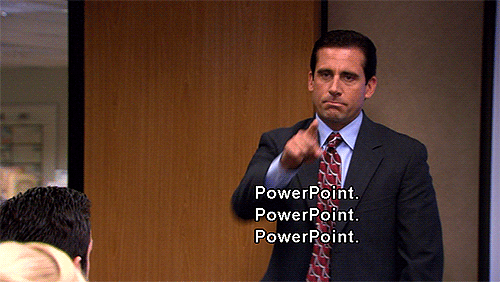

```{r setup, include=FALSE}
options(htmltools.dir.version = FALSE)
```
class: middle, center, inverse
background-image: url("http://www.pptbackgrounds.org/uploads/dark-blue-background-backgrounds-wallpapers.jpg")

## Because Powerpoint is so 2017 😛

.pull-left[

]

.pull-right[

]

---
class: center, middle, inverse
background-image: url("http://www.pptbackgrounds.org/uploads/dark-blue-background-backgrounds-wallpapers.jpg")
 
## Making HTTP requests to the Fitbit API


https://moldach.github.io/fitbit-project/

---
class: inverse
background-image: url("http://www.pptbackgrounds.org/uploads/dark-blue-background-backgrounds-wallpapers.jpg")

.left-code[
```{r plot-label, eval=FALSE}
# Generating textures...
ggcorrplot::ggcorrplot(corr, hc.order = TRUE, 
           type = "lower", 
           lab = TRUE, 
           lab_size = 2,
           tl.cex = 8,
           show.legend = FALSE,
           colors = c( "#306230", "#306230", "#0F380F" ), 
           title="Correlogram",
           ggtheme=theme_gameboy)
```
]

.right-plot[

]

---
class: center, middle, inverse
background-image: url("http://www.pptbackgrounds.org/uploads/dark-blue-background-backgrounds-wallpapers.jpg")
 


---
class: center, middle, inverse
background-image: url("http://www.pptbackgrounds.org/uploads/dark-blue-background-backgrounds-wallpapers.jpg")
 
## Animated visualizations 


---
class: center, middle, inverse
background-image: url("http://www.pptbackgrounds.org/uploads/dark-blue-background-backgrounds-wallpapers.jpg")
 

---
class: center, middle, inverse
background-image: url("http://www.pptbackgrounds.org/uploads/dark-blue-background-backgrounds-wallpapers.jpg")

## 3D PCA plot

.left-code[
```{r, eval=FALSE}
library(plot3d)
library(rgl)

plot3d(pc_scores[,1:3], size=10, type='p')
# output image
rgl.snapshot("3DPCA-Merge.png", "png") 
# output image series
dir.create("animation_merge")
for (i in 1:360) {
  view3d(userMatrix=rotationMatrix(2*pi * i/360, 0, 1, 0))
  rgl.snapshot(filename=paste("animation_merge/frame-",
                              sprintf("%03d", i), ".png", sep=""))}
```
]

.right-code[

]

---
class: center, middle, inverse
background-image: url("http://www.pptbackgrounds.org/uploads/dark-blue-background-backgrounds-wallpapers.jpg")
## Making better figures, faster!


https://www.getbiorender.com/

---
class: center, middle

---
class: center, middle, inverse
background-image: url("http://www.pptbackgrounds.org/uploads/dark-blue-background-backgrounds-wallpapers.jpg")
## Symbol libraries for figures

* https://reactome.org/icon-lib?f=cell_types
* https://smart.servier.com/
* https://www.freepik.com/
* http://ian.umces.edu/symbols/ 

---
class: center, middle## gganatogram


https://github.com/jespermaag/gganatogram
---
class: center, middle


---
class: center, middle
## 2D Brain ROIs with ggseg


https://github.com/LCBC-UiO/ggseg
---
class: center, middle

## 3D Brain ROIs BrainNet/Mango


https://bit.ly/2EzijI4

---
class: center, middle
## 3D Brain ROIs in R

```{r, eval = FALSE, echo = FALSE, results = TRUE, error = F, message=F}
if (!requireNamespace("widgetframe")) {
  install.packages("widgetframe")
} else {
  library(widgetframe)
}
if (!requireNamespace("rgl")) {
  install.packages("rgl")
} else {
  library(rgl)
}
if (!requireNamespace("misc3d")) {
  install.packages("misc3d")
} else {
  library(misc3d)
}
if (!requireNamespace("neurobase")) {
  install.packages("neurobase")
} else {
  library(neurobase)
}
if (!requireNamespace("aal")) {
  devtools::install_github("muschellij2/aal")
} else {
  library(aal)
}
if (!requireNamespace("MNITemplate")) {
  devtools::install_github("jfortin1/MNITemplate")
} else {
  library(MNITemplate)
}

img = aal_image()
template = readMNI(res = "2mm")
cut <- 4500
dtemp <- dim(template)

# All of the sections you can label
labs = aal_get_labels()

# Pick the region of the brain you would like to highlight - in this case the hippocamus_L
hippocampus = labs$index[grep("Hippocampus_L", labs$name)]

mask = remake_img(vec = img %in% hippocampus, img = img)

### this would be the ``activation'' or surface you want to render
contour3d(template, x=1:dtemp[1], y=1:dtemp[2], z=1:dtemp[3], level = cut, alpha = 0.1, draw = TRUE)
contour3d(mask, level = c(0.5), alpha = c(0.5), add = TRUE, color=c("red") )
### add text
text3d(x=dtemp[1]/2, y=dtemp[2]/2, z = dtemp[3]*0.98, text="Top")
text3d(x=-0.98, y=dtemp[2]/2, z = dtemp[3]/2, text="Right")
l <- rglwidget()
frameWidget(l)
# htmlwidgets::saveWidget(frameableWidget(l), "3D-Brain.html")
# htmltools::includeHTML("3D-Brain.html")
```

---
class: center, middle, inverse
background-image: url("http://www.pptbackgrounds.org/uploads/dark-blue-background-backgrounds-wallpapers.jpg")

## 📼👾🕹💾📺Vaporwave themes for ggplot2


https://github.com/moldach/vapoRwave
---
class: center, middle, inverse
background-image: url("http://www.pptbackgrounds.org/uploads/dark-blue-background-backgrounds-wallpapers.jpg")


---

class: inverse
background-image: url("http://www.pptbackgrounds.org/uploads/dark-blue-background-backgrounds-wallpapers.jpg")

.pull-left[

]

.pull-right[

]

---
class: center
background-image: url("http://www.pptbackgrounds.org/uploads/dark-blue-background-backgrounds-wallpapers.jpg")


---
class: center, inverse
background-image: url("http://www.pptbackgrounds.org/uploads/dark-blue-background-backgrounds-wallpapers.jpg")


---
class: inverse
background-image: url("http://www.pptbackgrounds.org/uploads/dark-blue-background-backgrounds-wallpapers.jpg")

## Set up a project

```{r setUp, eval=FALSE}
library(drake)
library(tidyverse)

create_plot <- function(data) {
  ggplot(data, aes(x = Petal.Width, fill = Species)) +
    geom_histogram()
}
```

---
class: inverse
background-image: url("http://www.pptbackgrounds.org/uploads/dark-blue-background-backgrounds-wallpapers.jpg")

## Declare each step in advance

```{r, eval=FALSE}
plan <- drake_plan(
    report = rmarkdown::render(
    knitr_in("report.html"),
    output_file = file_out("report.html"),
    quiet = TRUE
  ),
  
  raw_data = read_xl::read_xlsx(file_in("raw-data.xlsx")),
  
  data = raw_data %>% 
    mutate(Species = forcats::fct_inorder(Species)) %>% 
    select(-X_1),
  
  hist = create_plot(data),
  
  fit = lm(Sepal.Width ~ Petal.Width + Species, data)
)
```

---
class: inverse
background-image: url("http://www.pptbackgrounds.org/uploads/dark-blue-background-backgrounds-wallpapers.jpg")

## Run the project

```{r, eval=FALSE}
make(plan)
## target raw_data
## target data
## target fit
## target hist
## target report
```

---
class: inverse
background-image: url("http://www.pptbackgrounds.org/uploads/dark-blue-background-backgrounds-wallpapers.jpg")

## Change anything and drake detects changes

```{r, eval=FALSE}
# create_plot <- function(data) {
#   ggplot(data, aes(x = Petal.Width, fill = Species)) +
#     geom_histogram()
# }

create_plot <- function(data){
        ggplot(data, aes(x = Petal.Width, fill = Species)) +
                geom_histogram(binwidth = 0.25)
}
```
---
class: inverse
background-image: url("http://www.pptbackgrounds.org/uploads/dark-blue-background-backgrounds-wallpapers.jpg")

## drake detects changes

```{r, eval = FALSE}
config <- drake_config(plan)
outdated(config)
## [1] "hist"  "report"


vis_drake_graph(config)
```

---
class: center, middle


---
class: center, middle

 


---
class: center, inverse
background-image: url("http://www.pptbackgrounds.org/uploads/dark-blue-background-backgrounds-wallpapers.jpg")
## Reproducibilty and high-performance computing


```{r, eval = FALSE}
make(plan, jobs = 16, parallelism = "clustering")
```

---
class: center, middle, inverse
background-image: url("http://www.pptbackgrounds.org/uploads/dark-blue-background-backgrounds-wallpapers.jpg")


---
class: center, middle, inverse
background-image: url("http://www.pptbackgrounds.org/uploads/dark-blue-background-backgrounds-wallpapers.jpg")
 
## Questions


---
class: center, middle, inverse
background-image: url("http://www.pptbackgrounds.org/uploads/dark-blue-background-backgrounds-wallpapers.jpg")

## Thanks!

Slides created via the R package [**xaringan**](https://github.com/yihui/xaringan) which is powered by [**reactjs**](https://en.wikipedia.org/wiki/React_(JavaScript_library).

Twitter: [**@MattOldach**](https://twitter.com/MattOldach)

Website: [**moldach.github.io**](https://moldach.github.io/)

Slides: [https://moldach.github.io/xaringan-presentation_drake/](https://moldach.github.io/xaringan-presentation_drake/)
